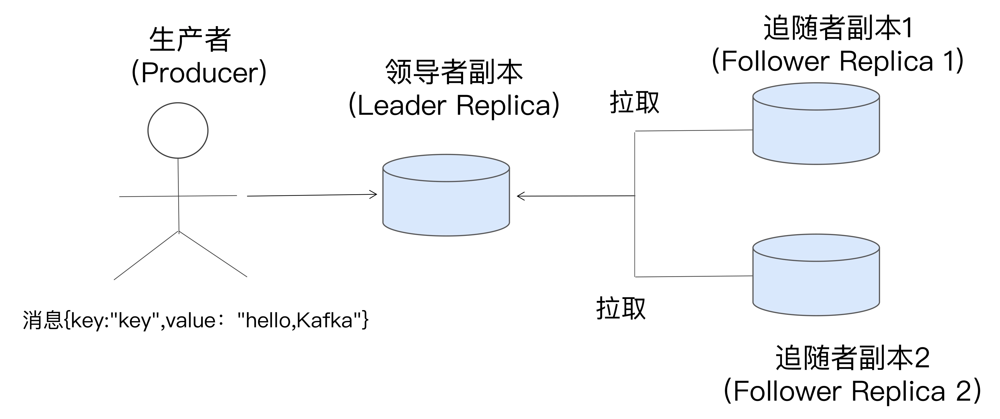

# 生产者消息分区机制
## 分区的作用
- 提供负载均衡的能力，保证系统的伸缩性

## 分区策略
### 轮询策略
### 随机策略
### 按消息键保序策略

## 消息丢失场景
### 生产者程序丢失数据
- 目前 Kafka Producer 是异步发送消息的，也就是说如果你调用的是 producer.send(msg) 这个 API，那么它通常会立即返回，但此时你不能认为消息发送已成功完成
- 应该使用带回调函数的方法，确保消息发送成功
### 消费端自动提交位移
- 使用手动提交位移，确保消费到消息

## 通信
### 通信协议
- TCP

## 消息交付
- 最多一次（at most once）：消息可能会丢失，但绝不会被重复发送。
- 至少一次（at least once）：消息不会丢失，但有可能被重复发送。
- 精确一次（exactly once）：消息不会丢失，也不会被重复发送。

### 密等性 & 事务
- 密等性保证单分区、单生产者消息密等
- 事务：多分区、多生产者的消息密等，性能较差

## Rebalance
### 弊端
- Rebalance 影响 Consumer 端 TPS。
- Rebalance 很慢。
- Rebalance 效率不高。
### 触发时机
- 组成员数量发生变化
- 订阅主题数量发生变化
- 订阅主题的分区数发生变化

### 避免rebalance
- 合理的设置发送心跳的参数， 需要仔细地设置 session.timeout.ms 和 heartbeat.interval.ms 的值
- 针对Rebalance 是 Consumer 消费时间过长导致的Rebalance, max.poll.interval.ms参数设置的长一些
- 排查一下 Consumer 端的 GC 表现

## 副本机制
- 基于领导者（Leader-based）的副本机制。

### 副本角色
- 领导者副本（Leader Replica）
    - 对外提供服务
- 追随者副本（Follower Replica）
    - 不对外提供服务

### In-sync Replicas (ISR)
- 通过 Broker 端参数 replica.lag.time.max.ms 参数值 来决定。
- 
- ISR 中的副本都是与 Leader 同步的副本，相反，不在 ISR 中的追随者副本就被认为是与 Leader 不同步的
- ISR 是一个动态调整的集合，而非静态不变的。