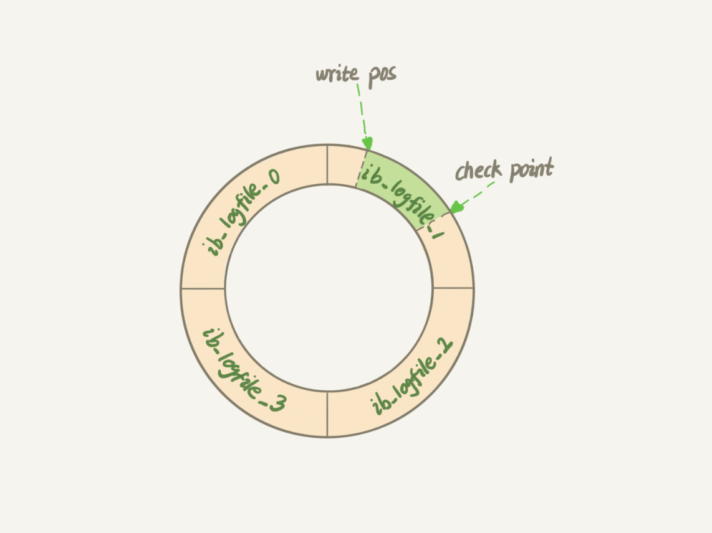
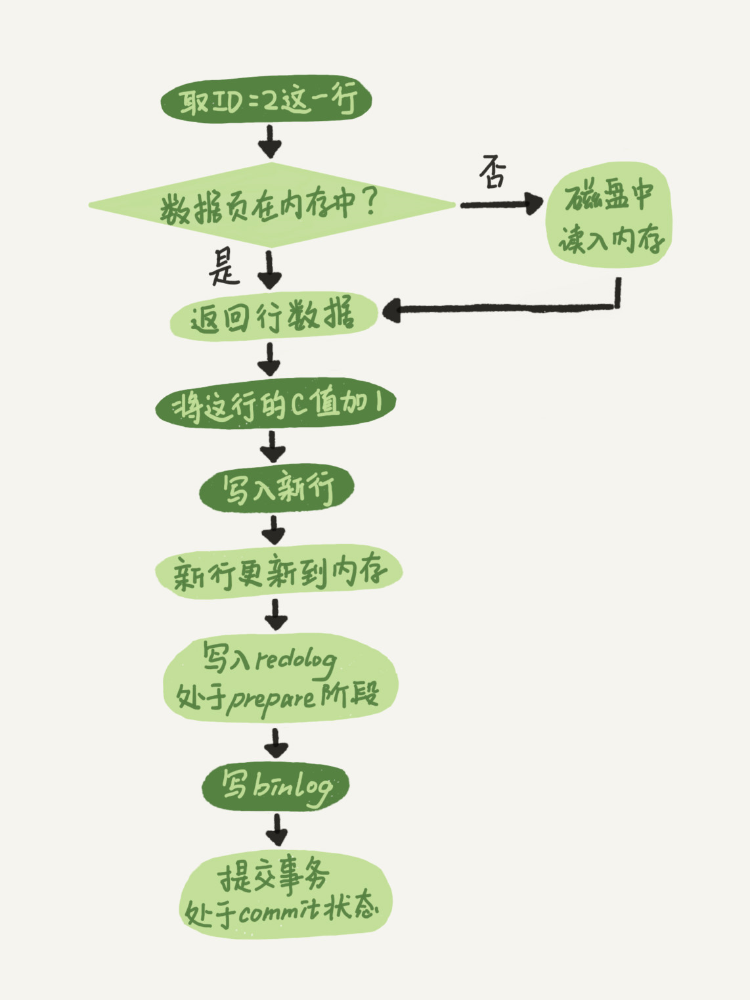

# MySQL 基础知识
### SQL查询执行顺序
- 客户端-->连接器-->分析器-->优化器-->执行器-->引擎
- 分析器会查询缓存，1.80以后会去掉缓存

### 日志系统
#### redo log(重做日志)
- 当有一条记录需要更新的时候，InnoDB 引擎就会先把记录写到 redo log里面，并更新内存，这个时候更新就算完成了。同时，InnoDB 引擎会在适当的时候，将这个操作记录更新到磁盘里面，而这个更新往往是在系统比较空闲的时候做

- write pos 当前记录位置
- checkpoint 当前要擦除的位置
- write pos 与 checkpoint 直接空着的部分，用来记录新的操作。
- redo 作用，保证数据库发生重启，之前提交的记录也不会丢失，这个能力称为: crash-safe
### bin log(归档日志)
- Bin log 用于记录了完整的逻辑记录，所有的逻辑记录在 bin log 里都能找到，所以在备份恢复时，是以 bin log 为基础，通过其记录的完整逻辑操作，备份出一个和原库完整的数据。
- 更新一条数据过程


#### redolog、undolog区别
- redo log 是 InnoDB 引擎特有的；binlog 是 MySQL 的 Server 层实现的，所有引擎都可以使用。
- redo log 是物理日志，记录的是“在某个数据页上做了什么修改”；binlog 是逻辑日志，记录的是这个语句的原始逻辑，比如“给 ID=2 这一行的 c 字段加 1 ”。
- redo log 是循环写的，空间固定会用完；binlog 是可以追加写入的。“追加写”是指 binlog 文件写到一定大小后会切换到下一个，并不会覆盖以前的日志。

### 基础增加、删除、修改、查询方法
- in、not in & exists、not exists
### 对表的操作
- 复制表
  - 查询表结构
  ```
  show create table tableName\G;
  # 复制表数据
  insert into tableNameIn selet * from tableNameOut;
  ```
- 临时表
```
create temporary table  `tableName` (
    `id` int default null,
    `name` varchar(20) detault null,
    ...
) engin=innodb default charset=utf8mb4;
```
### 函数

```
4.1 MySQL 字符串函数•
4.1.1 character_ Iength(s)：返回字符串长度
4.1.2 concat(s1,$2, …,Sn）：字符串合并
4.1.3 format(x,n)：数字格式化
4.1.4 Ipad(s1,len,$2)：字符串填充
4.1.5 field(s,s1,$2,…)：返回字符串出现的位置
4.1.6 insert(s1,x,len,$2)：替换字符串
4.1.7 lcase(s)：把字符串中的所有字母转换为小写字母
4.1.8 ucase(s)：把字符串中的所有字母转换为大写字母
4.1.9 strcmp(s1,$2)：比较字符串大小
4.1.10 replace(s,$1,$2)：宇符串替换
4.1.11 position(s1 in s)：获取子字符串在字符串中出现的位置
4.1.12 mds(s)：字符串加密•
4.1.13 inet aton(ip)：把卫地址转换为数字
4.1.14 inet ntoa (s)：把数字转换为卫地址
4.2 MySOL 数字函数⋯•
4.2.1 ceil()：返回不小于x的最小整数
4.2.2 ceiling(x)：返回不小于* 的最小整数
4.2.3 foor(x)：返回不大于x的最大整数
4.2.4 round(x)：返回最接近x的整数
4.2.5 max(expression)：求最大值
4.2.6 min(expression)：求最小值 •
4.2.7 sum(expression)：求总和••
4.2.8 avg(expression)：求平均值 •
4.2.9 count(expression)：求总记录数
4.3 MySOL 日期函数•
4.3.1 adddate(d,n)：返回指定日期加上指定天数后的日期
4.3.2 addtime(t,n)：返回指定时间加上指定时间后的时间
4.3.3 curdate()：返回当前日期•
4.3.4 datediffrd1,d2)：返回两个日期相隔的天数。
4.3.5 dayofyear(d)：返回指定日期是本年的第几天。
4.3.6 extract(type from d)：根据对应格式返回日期
4.3.7 now()：返回当前日期和时间
4.3.8 quarter(d)：返回日期对应的季度数
4.3.9 second(t)：返回指定时间中的秒数，
4.3.10 timedifftimel, time2)：计算时间差
4.3.11 date(t)：从指定日期时间中提取日期值
4.3.12 hour(D)：返回指定时间中的小时数。
4.3.13 time(expression)：提取日期时间参数中的时间部分
4.3.14 time_format(t,D：根据表达式显示时间
4.3.15 year(d)：返回指定日期的年份
4 MySOL 高级函数•
4.4.1 cast(x as type)：数据类型转换
4.4.2 coalesce(expr1, .,expm)：返回第一个非空表达式
4.4.3 iffexpr,v1,v2)：表达式判断
4.4.4 ifnull(v1,v2)：null 替换…
4.4.5 isnull(expression)：判断表达式是否为 null。
4.4.6 nullif(expr1, expr2)：字符串相等则返回 null
4.4.7 last_insert_id()：返回最近生成的自增 ID
4.4.8 case expression：表达式分支•
4.5 MySQL over()：窗口函数汇总分析，
4.5.1 row_number()：顺序排名函数
4.5.2 rank()：跳级排名西数。
4.5.3 dense_rank()：不跳级排名函数…
4.5.4 lag(expr,n)：前分析两数，返回前n行的值
4.5.5 lead(expr,n)：后分析函数，返回后口行的值⋯•
4.5.6 first_value(expr)：头尾函数，返回第一个值
4.5.7 last_value(expr)：头尾西数，返回最后一个值•
4.5.8 nth_ value(expt,n)：从结果集中的第n行获取值
4.5.9 ntile(n)：数据集分桶•
4.5.10 sum() over(expr)：聚合求和。
4.5.11 avg() over(expr)：聚合求平均值
4.5.12 max() over(expr)：聚合求最大值
4.5.13 min() over(expr)：聚合求最小值
4.5.14 count() over(expr)：聚合总条数
```