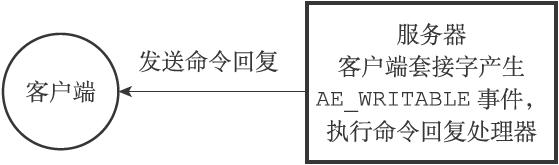
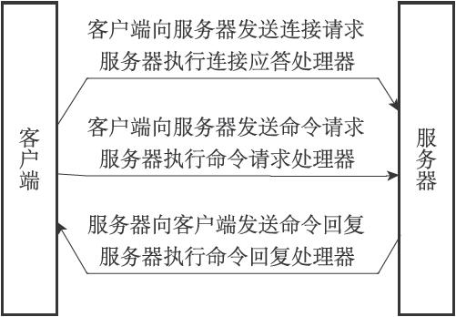
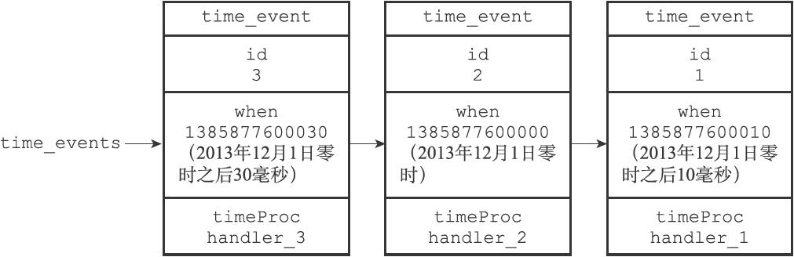
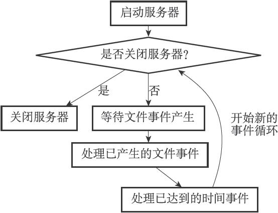

# 单机数据库的实现

## 数据库对象
    ```
    struct redisServer {
        // ...
        //
        一个数组，保存着服务器中的所有数据库
        redisDb *db;
        
        // 服务器的数据库数量
        int dbnum;
        // ...
    };
    ```
  - redisDb 代表一个数据库
  - dbnum 记录数据库数量，默认16个

## 数据库键空间
  - redisDb结构的dict字典保存了数据库中的所有键值对
  ```
  typedef struct redisDb {
    // ...
    //
    数据库键空间，保存着数据库中的所有键值对
    dict *dict;
    // ...
  } redisDb;
  ```
  - 键空间和用户所见的数据库是直接对应的
    - 键空间的键也就是数据库的键，每个键都是一个字符串对象
    - 键空间的值也就是数据库的值，每个值可以是字符串对象、列表对象、哈希表对象、集合对象和有序集合对象中的任意一种Redis对象
- 读写键空间时维护操作
  - 在读取一个键之后（读操作和写操作都要对键进行读取），服务器会根据键是否存在来更新服务器的键空间命中（hit）次数或键空间不命中（miss）次数，这两个值可以在INFO stats命令的keyspace_hits属性和keyspace_misses属性中查看。
  - 在读取一个键之后，服务器会更新键的LRU（最后一次使用）时间，这个值可以用于计算键的闲置时间，使用OBJECT idletime命令可以查看键key的闲置时间。
  - 如果服务器在读取一个键时发现该键已经过期，那么服务器会先删除这个过期键，然后才执行余下的其他操作，本章稍后对过期键的讨论会详细说明这一点。
  - 如果有客户端使用WATCH命令监视了某个键，那么服务器在对被监视的键进行修改之后，会将这个键标记为脏（dirty），从而让事务程序注意到这个键已经被修改过，第19章会详细说明这一点。
  - 服务器每次修改一个键之后，都会对脏（dirty）键计数器的值增1，这个计数器会触发服务器的持久化以及复制操作。
  - 如果服务器开启了数据库通知功能，那么在对键进行修改之后，服务器将按配置发送相应的数据库通知

## 设置键的生存时间或者过期时间
- 用EXPIRE、PEXPIRE命令可以以秒或毫秒设置数据库中某个键设置生存时间
- 设置方法
  - EXPIRE＜key＞＜ttl＞命令用于将键key的生存时间设置为ttl秒。
  - PEXPIRE＜key＞＜ttl＞命令用于将键key的生存时间设置为ttl毫秒。
  - EXPIREAT＜key＞＜timestamp＞命令用于将键key的过期时间设置为timestamp所指定的秒数时间戳。
  - PEXPIREAT＜key＞＜timestamp＞命令用于将键key的过期时间设置为timestamp所指定的毫秒数时间戳。
- 保存过期时间
  - redisDb结构中 expires字典用来保存数据库中所有键的过期时间，称为过期字典
    - 过期字典的键是一个指针，这个指针指向键空间中的某个键对象（也即是某个数据库键)
    - 过期字典的值是一个long long类型的整数，这个整数保存了键所指向的数据库键的过期时间——一个毫秒精度的UNIX时间戳。
- 移除过期时间
  - PERSIST 命令
  ```
  redis＞ PERSIST book
  (integer) 1
  ```
- 计算并返回剩余生存时间
  - TTL命令以秒为单位返回键的剩余生存时间，而PTTL命令则以毫秒为单位返回键的剩余生存时间
- 过期键的判定
  - 检查给定键是否存在于过期字典：如果存在，那么取得键的过期时间
  - 检查当前UNIX时间戳是否大于键的过期时间：如果是的话，那么键已经过期；否则的话，键未过期。
- 过期键删除策略
  - 三种删除策略
    - 定时删除
      - 对cpu不友好, 对内存友好
    - 惰性删除
      - 对cpu友好，对内存不友好 
    - 定期删除
      - 定时删除、惰性删除的折中方案
  - redis采用的方案
    - 惰性删除和定期删除两种策略
    - 惰性删除实现
      - 每次查询都会检查是否过期，如果过期直接删除，如果没过期，继续操作
    - 定期删除策略
      - 函数每次运行时，都从一定数量的数据库中取出一定数量的随机键进行检查，并删除其中的过期键。
      - 全局变量current_db会记录当前activeExpireCycle函数检查的进度，并在下一次activeExpireCycle函数调用时，接着上一次的进度进行处理。比如说，如果当前activeExpireCycle函数在遍历10号数据库时返回了，那么下次activeExpireCycle函数执行时，将从11号数据库开始查找并删除过期键。
      - 随着activeExpireCycle函数的不断执行，服务器中的所有数据库都会被检查一遍，这时函数将current_db变量重置为0，然后再次开始新一轮的检查工作。
  - AOF、RDB和复制功能对过期键的处理
    - RDB
      - 生成文件时
        - 对数据库的键进行检查，已过期的不会保存的RDB中
      - 载入RDB文件
        - 如果服务器是以主服务器模式运行，在载入RDB文件时，程序会对文件中保存的键进行检查，未过期的键会被载入到数据库中，过期的被忽略
        - 如果服务器以从服务器模式运行，在载入RDB文件时，文件中保存的所有键，不论是否过期，都会被载入到数据库中，因为主从服务器在进行数据同步的时候，从服务器的数据库就会被清空，所以，过期键对载入RDB文件的从服务器也不会造成影响。
    - AOF
      - 写入规则 
        - 只有在删除动作发生时，才会在文件中追加一个DEL命令，如果没发生删除操作，就算到期也不会删除
      - AOF重写规则
        - 执行AOF重写的过程中，程序会对数据库中的键进行检查，已过期的键不会被保存到重写后的AOF文件中
    - 复制
      - 从服务器的过期键删除动作由主服务器控制
        - 主服务器删除后，显式的向所有服务器发送DEL命令
        - 从服务器在执行客户端读命令，即使碰到过期键也不会将过期键删除
        - 从服务器只有接到祝福哇发来的DEL命令，才会删除过期键
# 持久化
## RDB与AOF
- RDB
  - 压缩过的二进制文件
  - 执行的SAVE与BGSAVE
    - SAVE 与 BGSAVE都是用来生成RDB文件的 
    -  SAVE由服务器进程执行保存工作, 执行会阻塞主进程
    -  BGSAVE 会fork一个子进程来完成写入操作，而主进程继续响应客户端任务
    ```
    def SAVE():
        #创建RDB文件
        rdbSave()
    def BGSAVE():
        #创建子进程
        pid = fork()
        if pid == 0:
            #子进程负责创建RDB文件
            rdbSave()
            #完成之后向父进程发送信号
            signal_parent()
        elif pid ＞ 0:
            #父进程继续处理命令请求，并通过轮询等待子进程的信号
            handle_request_and_wait_signal()
        else:
            #处理出错情况
            handle_fork_error()
    ```
  - RDB载入时服务器状态
    - 阻塞状态
  - dirty计数器与lastsave属性
    -  dirty计数器记录距离上一次成功执行SAVE命令之后，服务器对数据库状态进行了多少次修改
    -  lastsave属性是一个unix时间戳, 记录服务器上一次成功执行SAVE命令或者BGSAVE命令的时间
    ```
    struct redisServer {
        // ...
        //修改计数器
        long long dirty;
        //上一次执行保存的时间
        time_t lastsave;
        // ...
    };
    ```
  - RDB文件结构(大写为常量，小写为变量)
    - REDIS- 字符串
      - 载入时，用来判断是否为RDB文件 
    - db_version
      - 字符串，版本号 
    - databases
      - 包含着零个或任意多个数据库，以及各个数据库中的键值对数据
    - EOF - 字符串
      - 表示正文内容结束 
    - check_sum
      - 保存着一个校验和 
    
- databases 结构
  - SELECTDB、db_number、key_value_pairs三个部分
  - key_value_pairs 用来保存数据库中所有键值对，如果键值带过期时间，也会保存
- key_value_pairs 结构
  - TYPE、key、value
  - TYPE
    - REDIS_RDB_TYPE_STRING
    - REDIS_RDB_TYPE_LIST
    - REDIS_RDB_TYPE_SET
    - REDIS_RDB_TYPE_ZSET
    - REDIS_RDB_TYPE_HASH
    - REDIS_RDB_TYPE_LIST_ZIPLIST
    - REDIS_RDB_TYPE_SET_INTSET
    - REDIS_RDB_TYPE_ZSET_ZIPLIST
    - REDIS_RDB_TYPE_HASH_ZIPLIST 
- RDB自动间隔执行配置
```
save 900 1
save 300 10
save 60 10000

```
- 以上配置，满足如下一个条件就会触发RDB:
  - 服务器在900秒之内，对数据库进行了至少1次修改
  - 服务器在300秒之内，对数据库进行了至少10次修改
  - 服务器在60秒之内，对数据库进行了至少10000次修改

### RDB总结
- RDB文件用于保存和还原Redis服务器所有数据库中的所有键值对数据。
- SAVE命令由服务器进程直接执行保存操作，所以该命令会阻塞服务器。
- BGSAVE令由子进程执行保存操作，所以该命令不会阻塞服务器。
- 服务器状态中会保存所有用save选项设置的保存条件，当任意一个保存条件被满足时，服务器会自动执行BGSAVE命令。
- RDB文件是一个经过压缩的二进制文件，由多个部分组成。
- 对于不同类型的键值对，RDB文件会使用不同的方式来保存它们。

## AOF持久化
- 命令追加（append）、文件写入、文件同步（sync）三个步骤
### AOF持久化效率和安全性
- appendfsync 配置决定AOF的效率和安全性
  - always
    - 每个事件循环都要将aof_buf缓冲区的所有内容写入到AOF，并且同步AOF文件
    - 效率最慢、安全性最高
  - everysec
    - 服务器在每个事件循环都要将aof_buf缓冲区中的所有内容写入到AOF文件，并且每隔一秒就要在子线程中对AOF文件进行一次同步
    - 效率高、出现故障丢失一秒的数据
  - no
    - 服务器在每个事件循环都要将aof_buf缓冲区中的所有内容写入到AOF文件
    - 至于何时对AOF文件进行同步，则由操作系统控制
    - 效率最快，但是出现故障丢失的数据也是最多的
- 重点
  - AOF文件通过保存所有修改数据库的写命令请求来记录服务器的数据库状态
  - AOF文件中的所有命令都以Redis命令请求协议的格式保存
  - 命令请求会先保存到AOF缓冲区里面，之后再定期写入并同步到AOF文件
  - appendfsync选项的不同值对AOF持久化功能的安全性以及Redis服务器的性能有很大的影响
  - 服务器只要载入并重新执行保存在AOF文件中的命令，就可以还原数据库本来的状态
  - AOF重写可以产生一个新的AOF文件，这个新的AOF文件和原有的AOF文件所保存的数据库状态一样，但体积更小
  - AOF重写是一个有歧义的名字，该功能是通过读取数据库中的键值对来实现的，程序无须对现有AOF文件进行任何读入、分析或者写入操作
  - 在执行BGREWRITEAOF命令时，Redis服务器会维护一个AOF重写缓冲区，该缓冲区会在子进程创建新AOF文件期间，记录服务器执行的所有写命令。当子进程完成创建新AOF文件的工作之后，服务器会将重写缓冲区中的所有内容追加到新AOF文件的末尾，使得新旧两个AOF文件所保存的数据库状态一致。最后，服务器用新的AOF文件替换旧的AOF文件，以此来完成AOF文件重写操作

- AOF与RDB优先级
  - 系统优先使用AOF文件还原数据库，如果关闭AOF，才会使用RDB 

# 事件
## 文件事件


- 组成部分
  - 套接字
  - /O多路复用程序
  - 文件事件分派器（dispatcher）
  - 以及事件处理器
- 事件类型
  - AE_READABLE
    - 当套接字变得可读时（客户端对套接字执行write操作，或者执行close操作），或者有新的可应答（acceptable）套接字出现时（客户端对服务器的监听套接字执行connect操作），套接字产生AE_READABLE事件
  - AE_WRITABLE
    - 当套接字变得可写时（客户端对套接字执行read操作），套接字产生AE_WRITABLE事件
  - *文件事件分派器会优先处理AE_READABLE事件，等到AE_READABLE事件处理完之后，才处理AE_WRITABLE事件*

- 文件事件处理器
  - 连接应答处理器 
    
    - networking.c/acceptTcpHandler函数是Redis的连接应答处理器，这个处理器用于对连接服务器监听套接字的客户端进行应答，具体实现为sys/socket.h/accept函数的包装
  - 命令请求处理器
    
    - 当一个客户端通过连接应答处理器成功连接到服务器之后，服务器会将客户端套接字的AE_READABLE事件和命令请求处理器关联起来，当客户端向服务器发送命令请求的时候，套接字就会产生AE_READABLE事件，引发命令请求处理器执行，并执行相应的套接字读入操作
  - 命令回复处理器
    
    - 当服务器有命令回复需要传送给客户端的时候，服务器会将客户端套接字的AE_WRITABLE事件和命令回复处理器关联起来，当客户端准备好接收服务器传回的命令回复时，就会产生AE_WRITABLE事件，引发命令回复处理器执行，并执行相应的套接字写入操作

- 一次完整的客户端与服务端的通信


## 时间事件
- Redis服务器中的一些操作（比如serverCron函数）需要在给定的时间点执行，而时间事件就是服务器对这类定时操作的抽象
- 分类
  - 定时事件
  - 周期性事件
  - *目前版本只使用了周期性事件*
- 时间事件组成
  - id
  - when
  - timeProc(函数，调用相应的处理器处理事件)
- 实现
  - 所有时间事件都放在一个无序链表中, 每当时间事件执行器运行时，它就遍历整个链表，查找所有已到达的时间事件，并调用相应的事件处理器
  

- serverCron函数工作内容
  - 更新服务器的各类统计信息，比如时间、内存占用、数据库占用情况等。
  - 清理数据库中的过期键值对
  - 关闭和清理连接失效的客户端
  - 尝试进行AOF或RDB持久化操作
  - 如果服务器是主服务器，那么对从服务器进行定期同步
  - 如果处于集群模式，对集群进行定期同步和连接测试
## 事件调度与执行 
 

# 客户端
## 内容简介
- 特点
  - redis服务器是一对多(一个服务器对应多个客户端)
  - 通过I/O多路复用技术实现文件事件处理器
  - 单线程单进程方式来处理命令请求
  - 对于每个与服务器连接的客户端,都建立 redis.h/redisClient结构，保存当前客户端状态
  - 多个客户端以clients链表形式存储
## 客户端属性
- 
## 客户端创建与关闭


## 重点
- 服务器状态结构使用clients链表连接起多个客户端状态，新添加的客户端状态会被放到链表的末尾
- 客户端状态的flags属性使用不同标志来表示客户端的角色，以及客户端当前所处的状态
- 输入缓冲区记录了客户端发送的命令请求，这个缓冲区的大小不能超过1GB
- 命令的参数和参数个数会被记录在客户端状态的argv和argc属性里面，而cmd属性则记录了客户端要执行命令的实现函数
- 客户端有固定大小缓冲区和可变大小缓冲区两种缓冲区可用，其中固定大小缓冲区的最大大小为16KB，而可变大小缓冲区的最大大小不能超过服务器设置的硬性限制值。
- 输出缓冲区限制值有两种，如果输出缓冲区的大小超过了服务器设置的硬性限制，那么客户端会被立即关闭；除此之外，如果客户端在一定时间内，一直超过服务器设置的软性限制，那么客户端也会被关闭。
- 当一个客户端通过网络连接连上服务器时，服务器会为这个客户端创建相应的客户端状态。网络连接关闭、发送了不合协议格式的命令请求、成为CLIENT KILL命令的目标、空转时间超时、输出缓冲区的大小超出限制，以上这些原因都会造成客户端被关闭。
- 处理Lua脚本的伪客户端在服务器初始化时创建，这个客户端会一直存在，直到服务器关闭。
- 载入AOF文件时使用的伪客户端

# 服务器
- Redis服务器负责与多个客户端建立网络连接，处理客户端发送的命令请求，在数据库中保存客户端执行命令所产生的数据，并通过资源管理来维持服务器自身的运转

## 命令请求的执行过程(单机模式下执行命令)
``` SET KEY value```
- 客户端向服务器发送命令请求SET KEY VALUE
  - 客户端命令请求转换成协议格式
  - 通过连接到服务器的套接字，将协议格式的命令请求发送给服务器
- 服务器接收并处理客户端发来的命令请求SET KEY VALUE，在数据库中进行设置操作，并产生命令回复OK。
  - 连接套接字因为客户端的写入而变得可读
  - 服务端读取套接字中协议格式的命令请求，并将其保存到客户端状态的输入缓冲区里面
  - 对输入缓冲区中的命令请求进行分析，提取出命令请求中包含的命令参数，以及命令参数的个数，然后分别将参数和参数个数保存到客户端状态的argv属性和argc属性里面。
  - 调用命令执行器，执行客户端指定的命令
  - 命令执行器找到的命令并保存到客户端状态的cmd属性里面
  - 命令执行器执行预备操作
    - 检查客户端状态的cmd指针
    - 根据客户端cmd属性指向的redisCommand结构的arity属性，检查命令请求所给定的参数个数是否正确
    - 检查客户端是否已经通过了身份验证
    - 如果服务器打开了maxmemory功能，那么在执行命令之前，先检查服务器的内存占用情况
    - 如果服务器上一次执行BGSAVE命令时出错，并且服务器打开了stop-writes-on-bgsave-error功能，而且服务器即将要执行的命令是一个写命令，那么服务器将拒绝执行这个命令，并向客户端返回一个错误。
    - 如果客户端当前正在用SUBSCRIBE命令订阅频道，或者正在用PSUBSCRIBE命令订阅模式，那么服务器只会执行客户端发来的SUBSCRIBE、PSUBSCRIBE、UNSUBSCRIBE、PUNSUBSCRIBE四个命令，其他命令都会被服务器拒绝。
    - 如果服务器正在进行数据载入，那么客户端发送的命令必须带有l标识（比如INFO、SHUTDOWN、PUBLISH等等）才会被服务器执行，其他命令都会被服务器拒绝。
    - 如果客户端正在执行事务，那么服务器只会执行客户端发来的EXEC、DISCARD、MULTI、WATCH四个命令，其他命令都会被放进事务队列中。
    - 如果服务器打开了监视器功能，那么服务器会将要执行的命令和参数等信息发送给监视器
  - 调用命令的实现函数
    - 因为需要执行的命令已经保存在cmd中,所以只需要执行:```client-＞cmd-＞proc(client); // client是指向客户端状态的指针```
    - 被调用的命令实现函数会执行指定的操作，并产生相应的命令回复，这些回复会被保存在客户端状态的输出缓冲区里面（buf属性和reply属性
    - 实现函数还会为客户端的套接字关联命令回复处理器，这个处理器负责将命令回复返回给客户端。
  - 执行后续工作
    - 如果服务器开启了慢查询日志功能，那么慢查询日志模块会检查是否需要为刚刚执行完的命令请求添加一条新的慢查询日志。
    - 根据刚刚执行命令所耗费的时长，更新被执行命令的redisCommand结构的milliseconds属性，并将命令的redisCommand结构的calls计数器的值增一。
    - 如果服务器开启了AOF持久化功能，那么AOF持久化模块会将刚刚执行的命令请求写入到AOF缓冲区里面。
    - 如果有其他从服务器正在复制当前这个服务器，那么服务器会将刚刚执行的命令传播给所有从服务器。
- 服务器将命令回复OK发送给客户端
  - 当客户端套接字变为可写状态时，服务器就会执行命令回复处理器，将保存在客户端输出缓冲区中的命令回复发送给客户端
  - 当命令回复发送完毕之后，回复处理器会清空客户端状态的输出缓冲区，为处理下一个命令请求做好准备。
- 客户端接收服务器返回的命令回复OK，并将这个回复打印给用户观看
  - 客户端接收到协议格式的命令回复之后，它会将这些回复转换成人类可读的格式，并打印给用户观看

## serverCron函数
*Redis服务器中的serverCron函数默认每隔100毫秒执行一次，这个函数负责管理服务器的资源，并保持服务器自身的良好运转。*
### 更新服务器时间缓存
- 为了减少系统调用的执行次数，服务器状态中的unixtime属性和mstime属性被用作当前时间的缓存
```
struct redisServer {
      // ...
      //保存了秒级精度的系统当前UNIX时间戳
      time_t unixtime;
      //保存了毫秒级精度的系统当前UNIX时间戳
      long long mstime;
      // ...
};
```
  - 服务器只会在打印日志、更新服务器的LRU时钟、决定是否执行持久化任务、计算服务器上线时间（uptime）这类对时间精确度要求不高的功能上。
  - 对于为键设置过期时间、添加慢查询日志这种需要高精确度时间的功能来说，服务器还是会再次执行系统调用，从而获得最准确的系统当前时间
- 更新LRU时钟
  - 每个Redis对象都会有一个lru属性，这个lru属性保存了对象最后一次被命令访问的时间
  - 当服务器要计算一个数据库键的空转时间（也即是数据库键对应的值对象的空转时间）​，程序会用服务器的lruclock属性记录的时间减去对象的lru属性记录的时间，得出的计算结果就是这个对象的空转时间
```
struct redisServer {
    // ...
    //默认每10秒更新一次的时钟缓存，
    //用于计算键的空转（idle）时长。
    unsigned lruclock:22;
    // ...
};

typedef struct redisObject {
    // ...
    unsigned lru:22;
    // ...
} robj;
```
### 更新服务器每秒执行命令次数
- serverCron函数中的trackOperationsPerSecond函数会以每100毫秒一次的频率执行，这个函数的功能是以抽样计算的方式，估算并记录服务器在最近一秒钟处理的命令请求数量
### 更新服务器内存峰值记录
- 服务器状态中的stat_peak_memory属性记录了服务器的内存峰值大小
  - 每次serverCron函数执行时，程序都会查看服务器当前使用的内存数量，并与stat_peak_memory保存的数值进行比较，如果当前使用的内存数量比stat_peak_memory属性记录的值要大，那么程序就将当前使用的内存数量记录到stat_peak_memory属性里面。
```
struct redisServer {
    // ...
    //已使用内存峰值
    size_t stat_peak_memory;
    // ...
};
```
### 处理SIGTERM信号
- 在启动服务器时，Redis会为服务器进程的SIGTERM信号关联处理器sigtermHandler函数，这个信号处理器负责在服务器接到SIGTERM信号时，打开服务器状态的shutdown_asap标识
```
// SIGTERM信号的处理器
static void sigtermHandler(int sig) {
    //打印日志
    redisLogFromHandler(REDIS_WARNING,"Received SIGTERM, scheduling shutdown...");
    //打开关闭标识
    server.shutdown_asap = 1;
}
```
- 服务器在关闭自身之前会进行RDB持久化操作，这也是服务器拦截SIGTERM信号的原因，如果服务器一接到SIGTERM信号就立即关闭，那么它就没办法执行持久化操作了

### 管理客户端资源
- serverCron函数每次执行都会调用clientsCron函数，clientsCron函数会对一定数量的客户端进行以下两个检查
  - 如果客户端与服务器之间的连接已经超时（很长一段时间里客户端和服务器都没有互动）​，那么程序释放这个客户端
  - 如果客户端在上一次执行命令请求之后，输入缓冲区的大小超过了一定的长度，那么程序会释放客户端当前的输入缓冲区，并重新创建一个默认大小的输入缓冲区，从而防止客户端的输入缓冲区耗费了过多的内存

### 管理数据库资源
- serverCron函数每次执行都会调用databasesCron函数，这个函数会对服务器中的一部分数据库进行检查，删除其中的过期键，并在有需要时，对字典进行收缩操作
### 执行被延迟的BGREWRITEAOF
- 在服务器执行BGSAVE命令的期间，如果客户端向服务器发来BGREWRITEAOF命令，那么服务器会将BGREWRITEAOF命令的执行时间延迟到BGSAVE命令执行完毕之后
### 检查持久化操作的运行状态
- 服务器状态使用rdb_child_pid属性和aof_child_pid属性记录执行BGSAVE命令和BGREWRITEAOF命令的子进程的ID，这两个属性也可以用于检查BGSAVE命令或者BGREWRITEAOF命令是否正在执行
### 将AOF缓冲区中的内容写入AOF文件
- 如果服务器开启了AOF持久化功能，并且AOF缓冲区里面还有待写入的数据，那么serverCron函数会调用相应的程序，将AOF缓冲区中的内容写入到AOF文件里面
### 关闭异步客户端
### 增加cronloops计数器的值
- cronloops属性目前在服务器中的唯一作用，就是在复制模块中实现“每执行serverCron函数N次就执行一次指定代码”的功能


# 用户、客户端、服务端关系图


